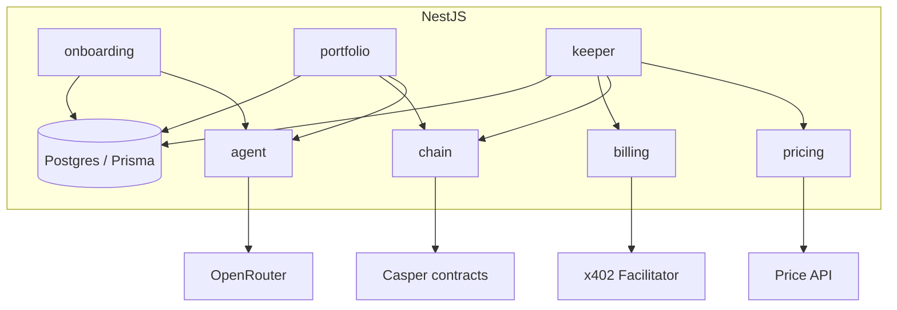

# Backend — Architecture

Design of the NestJS backend (API + agent + keeper). For the on-chain layer it drives, see `../contract/ARCHITECTURE.md`; for the UI it serves, `../frontend/ARCHITECTURE.md`.

---

## 1. Module map



Two hard boundaries:
- **`chain` is the only module that touches Casper.** Everything else calls `chain`.
- **`agent` is the only module that calls OpenRouter.** No money math lives in it.

---

## 2. The agent (LLM boundary)

Model served via OpenRouter (configurable). The LLM is used only for judgment, suggestion, and explanation — never for executed numbers.

| Use | Input | Output | Executed? |
| --- | --- | --- | --- |
| Profiling | answers + demographics | `{ profile, reasoning }` | selects a bucket → deterministic logic follows |
| Starter / custom allocation | profile, goal | suggested `allocation` (bps) | **user-editable**; stored value is what executes |
| Rebalance rationale | computed pre/post weights + swaps | natural-language text | display only |
| Q&A | portfolio snapshot + question | answer | display only |

Profiling returns a classification (a bucket), which then drives purely deterministic logic. The LLM never returns swap amounts, the stored allocation, or the contribution figure.

---

## 3. Keeper loops (`@nestjs/schedule`)

### Price loop (`KEEPER_INTERVAL_MS`)
Fetch real reference prices (CoinGecko for BTC/gold; a stock source for NVDA/GOOGL, mapped onto `mNVDAx`/`mGOOGLx`) → `chain.setPrice` on the oracle. Every write logged with `source = keeper`. A separate **manual override** endpoint writes with `source = manual-override` so a demo can push a portfolio out of band on stage.

### Rebalance loop (`REBALANCE_INTERVAL_MS`)
For each vault: read holdings + prices + **the contract's computed target** (via `view_state`), compute drift, and if a rebalance is due (§4.1) acquire the **idempotency lock**, call the x402-gated trigger, then `chain.rebalance(vault)`, then write a `RebalanceLog` with the LLM rationale.

A manual **"rebalance now"** endpoint exists for demos.

---

## 4. Deterministic algorithms (owned by the backend)

The backend owns the **decision** (when to rebalance) and the **projection**. It does **not** own the glide target (that's computed on-chain and read via `view_state`).

### 4.1 Rebalance decision (threshold band, per profile)

| Profile | Drift band | Annual return assumption |
| --- | --- | --- |
| Conservative | ±3% (300 bps) | 6% |
| Moderate | ±5% (500 bps) | 12% |
| Aggressive | ±8–10% (≈800 bps) | 20% |

```
state = chain.view_state(vault)         // holdings + computed target
prices = chain.getPrices()
total = Σ holding[a] * price[a]
maxDrift = max_a | currentWeight[a] - state.target[a] |
due = maxDrift >= band(profile)
     && lastRebalance(vault) older than 1 day
     && estimatedTradeSize >= MIN_TRADE
```
If `due`, trigger; the contract executes the swaps back to the exact target (slippage-capped). Guards: min trade size, max once/day/vault, and the lock (prevents overlapping loops or simultaneous deposits double-executing).

### 4.2 Contribution projection ("deposit $X/month")

Recomputed **live** from the current actual value each request, so the on-track indicator self-corrects.

```
PV = current portfolio value (USD)        // from holdings * prices
FV = target_amount_usd
r  = return assumption for the profile
n  = years_left                            // fractional ok
i  = (1 + r)^(1/12) - 1
m  = 12 * n

PMT = (FV - PV * (1 + i)^m) * i / ((1 + i)^m - 1)
if PMT <= 0: user is ahead of target
```
The return assumption is surfaced to the user as an explicit assumption, not a promise. Use a decimal/bigint money library for these computations — never plain JS `number` for value math.

---

## 5. Data model (Postgres / Prisma)

| Entity | Contents |
| --- | --- |
| `User` | wallet address, created_at |
| `Questionnaire` | versioned risk questions + demographics questions |
| `Answer` | raw answers per user |
| `Profile` | result + LLM reasoning + score |
| `PortfolioMeta` | vault hash ↔ user, name, base-allocation snapshot, target amount/year (mirror for fast UI) |
| `RebalanceLog` | timestamp, pre/post weights, swaps, **LLM rationale**, x402 receipt |
| `PriceLog` | every `set_price` (value + `source`: `keeper` \| `manual-override`) |
| `ChatMessage` | agent Q&A history |
| `ProjectionCache` | last computed required contribution + on-track status |

On-chain state (balances, computed target, config) is **read live from the contracts**, not stored as truth here. The DB holds PII, text, history, and display-only derived values (per the on/off-chain split in `../contract/ARCHITECTURE.md`).

---

## 6. Flows (backend perspective)

### Onboarding
`POST /onboarding/answers` → `agent.profile()` → derive starter targets from demographics → `agent.suggestAllocation()` per portfolio → return profile + starters. Vault creation itself is **user-signed in the frontend**; the backend then records `PortfolioMeta`.

### Deposit → buy
The frontend submits the user-signed `deposit`. The keeper/chain module observes the `Deposited` event (CSPR.cloud Streaming) and calls `chain.executeBuy(vault)` with the **agent key** (amounts computed in-contract).

### Rebalance
Keeper decision (§4.1) → x402 fee (`billing`) → `chain.rebalance(vault)` → `agent.explain()` → `RebalanceLog`.

### Withdraw
Entirely user-signed in the frontend; backend just reflects the resulting state.

---

## 7. x402 (rebalance only)

Additive. The rebalance trigger endpoint is x402-gated, pulling a micro-fee (e.g. 0.1%) in `mUSDC` per rebalance — framing the agent as a paid autonomous service (Casper's machine-economy thesis). Do not spread x402 elsewhere.

---

## 8. Security

- **Agent hot key** loaded from `AGENT_SECRET_KEY_PATH`; never logged, never returned over the API. Its power is confined by the contracts (it can only `execute_buy`/`rebalance`; no withdraw). Single key is accepted for the hackathon; production path is account-abstraction session keys.
- **The backend must never attempt a withdraw with the agent key** — there is no such contract path, and no code should try to construct one.
- **Validation:** validate `Σ allocation == 10000` and asset membership before any user-signed config call is surfaced (the contract is authoritative, but fail fast in the API).
- **Idempotency lock** around the rebalance loop and deposit→buy keyed by deposit/event id.
- **Secrets** (`secrets/`, `.env`) excluded from VCS.