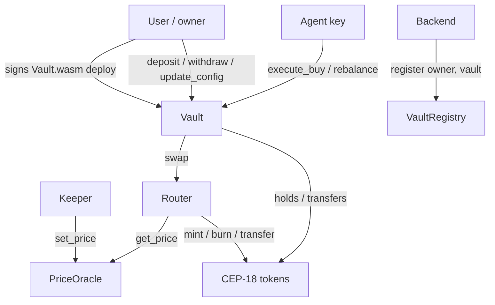

# Contracts — Architecture

The authoritative spec for Stigma Agent's on-chain layer. For the backend/frontend that consume these contracts, see `../backend/ARCHITECTURE.md` and `../frontend/ARCHITECTURE.md`.

All contracts are Odra modules → WASM. Money is fixed-point (USD, 6 dp); weights are basis points (Σ = 10000). Signatures are conceptual Rust-ish pseudocode.

---

## 1. Contract set & relationships

> **Vault creation is a user-signed `Vault.wasm` deploy, not a factory call.**
> Casper has no contract-deploys-contract primitive, so there is no
> `VaultFactory`. The user signs the `Vault` module-bytes deploy (becoming
> deployer + `owner`); the backend then records it via the permissionless
> `VaultRegistry.register(owner, vault)`. See
> [`../docs/decisions/0001-vault-creation-path.md`](../docs/decisions/0001-vault-creation-path.md)
> and the feasibility note in [`src/registry.rs`](src/registry.rs).



Two distinct authorities act on a `Vault`: **`owner`** (the user) and **`agent`** (one shared backend key). The split is the heart of the security model.

---

## 2. Access-control table (this is law)

| Contract.Function | Allowed caller | Notes |
| --- | --- | --- |
| `Vault.init` (deploy) | **user** (signs the `Vault.wasm` deploy) | deployer passes `owner` = self, `agent` = configured address; see ADR 0001 |
| `VaultRegistry.register` | anyone (backend, in practice) | permissionless + idempotent; moves no funds; records `vault` under `owner` |
| `Vault.deposit` | **owner** | escrows `mUSDC`; does not swap |
| `Vault.execute_buy` | **agent** | swaps idle `mUSDC` into the current target; slippage-capped |
| `Vault.rebalance` | **agent** | swaps holdings toward current target; slippage-capped |
| `Vault.withdraw` | **owner** | sells holdings → `mUSDC` → owner. **No agent path.** |
| `Vault.update_config` | **owner** | edit allocation / target amount / target year |
| `Vault.view_state` | anyone | holdings, computed target allocation, config |
| `PriceOracle.set_price` | **keeper/owner** | testnet mock |
| `PriceOracle.get_price` | anyone | — |
| `Router.swap` | vaults | enforces `min_out` |
| `mUSDC.faucet_mint` | anyone | demo funding only |

> **Invariant #1:** `agent` is permitted on `execute_buy` and `rebalance` only. `withdraw` is `owner`-only with no agent-reachable path. A leaked agent key can, at worst, trigger a harmless extra rebalance.

---

## 3. On-chain data model (per Vault)

| Field | Type | Notes |
| --- | --- | --- |
| `owner` | `Address` | the user |
| `agent` | `Address` | shared agent key |
| `profile` | `enum` | `Conservative` / `Moderate` / `Aggressive` |
| `base_allocation` | `Map<Token, u32>` | bps, Σ = 10000; the growth-tilted start point |
| `target_amount_usd` | `u64` | goal amount, 6 dp |
| `target_year` | `u16` | goal year |
| `created_year` | `u16` | sets the glide horizon |
| holdings | token balances | the vault's CEP-18 balances |

The **current target allocation is not stored** — it is computed on demand from the fields above + block time (§5). This is what keeps the agent trigger-only.

---

## 4. Interfaces

### VaultRegistry
```rust
fn register(owner, vault)          // permissionless + idempotent; moves no funds
fn list_vaults(owner) -> Vec<Address>
```
There is **no `VaultFactory`** (Casper can't deploy a contract from a contract).
A vault is created by **user-signing the `Vault.wasm` module-bytes deploy**, then
the backend calls `register`. See ADR 0001. `Vault::init` (run at deploy time)
validates `sum(base_allocation) == 10000` and asset membership, and sets
`created_year` from block time.

### Vault
```rust
fn deposit(amount)                 // owner; pull mUSDC, emit Deposited
fn execute_buy()                   // agent; allocate idle mUSDC across current target
fn rebalance()                     // agent; move holdings toward current target
fn withdraw(amount_or_all)         // owner; sell to mUSDC, transfer to owner
fn update_config(alloc?, amt?, yr?)// owner; re-validate sum == 10000
fn view_state() -> VaultState      // anyone; includes computed current target
```

### PriceOracle (mock)
```rust
fn set_price(token, price)          // keeper/owner
fn get_price(token) -> u64          // USD, 6 dp
```

### Router (mock)
```rust
fn swap(token_in, token_out, amount_in, min_out) -> u64
// amount_out = amount_in * price(in) / price(out); revert if < min_out
```
Has mint authority on the mock tokens, so no real liquidity pool is needed.

### CEP-18 tokens
Standard `odra-modules` CEP-18; `mUSDC` adds `faucet_mint(amount)`.

---

## 5. Glide-path target (computed in-contract)

The target allocation is a function of years remaining, so it de-risks toward the goal. Integer bps math only.

```
horizon   = target_year - created_year
years_left = max(0, target_year - current_year)        // current_year from block time
f = clamp_bps(years_left * 10000 / horizon, 0, 10000)  // 10000 = far, 0 = at goal

for each asset a:
    target_bps[a] = end_bps[a] + f * (start_bps[a] - end_bps[a]) / 10000
// renormalize so sum == 10000 (distribute rounding remainder)
```

- `start_bps` = `base_allocation` (growth-tilted).
- `end_bps` = a de-risked mix (gold + stablecoin heavy), per profile — defined in contract constants.

Example end states (tune as desired):

| Profile | Start | End (at goal year) |
| --- | --- | --- |
| Moderate | BTC 20 · mNVDAx 30 · mXAUT 40 · mGOOGLx 10 | mXAUT 50 · mUSDC 50 |
| Conservative | mXAUT 40 · mUSDC 30 · BTC 10 · mNVDAx 10 · mGOOGLx 10 | mUSDC 70 · mXAUT 30 |
| Aggressive | BTC 40 · mNVDAx 35 · mGOOGLx 15 · mXAUT 10 | mXAUT 40 · BTC 20 · mUSDC 40 |

`view_state()` returns this computed target so the backend/frontend never re-implement the math.

---

## 6. Execution logic (internal — agent only triggers)

### `execute_buy()`
```
idle = mUSDC balance of vault
target = glide_target()                 // §5
for each asset a (except mUSDC):
    spend = idle * target_bps[a] / 10000
    min_out = quote(mUSDC, a, spend) * (10000 - SLIPPAGE_BPS) / 10000
    router.swap(mUSDC, a, spend, min_out)   // partial fills allowed (see §7)
```
The agent supplies **no amounts** — they are derived from on-chain `idle` + computed target.

### `rebalance()`
```
prices  = oracle.get_price(*)
total   = Σ holding[a] * price[a]
target  = glide_target()
for each asset a:
    target_value[a] = total * target_bps[a] / 10000
    delta[a]        = target_value[a] - holding[a] * price[a]   // <0 sell, >0 buy
# sell legs (delta<0) to mUSDC first, then buy legs (delta>0); each leg slippage-capped
```
Rebalances back to the **exact** computed target. The *decision* of whether to call `rebalance()` at all (drift band, frequency) is made off-chain by the keeper; the contract enforces correctness and slippage.

### Router pricing
`amount_out = amount_in * price(token_in) / price(token_out)`, revert if `< min_out`.

---

## 7. Failure handling

A swap leg that can't satisfy `min_out` reverts that **leg**; `execute_buy` / `rebalance` continue with the remaining legs (partial fill by design). The portfolio is briefly off-target; the next rebalance cycle heals it. A failure of an access-control or invariant check (wrong caller, `sum != 10000`) aborts the whole call.

---

## 8. Events

Emit events the backend keeper/indexer listens to (via CSPR.cloud Streaming):
`Deposited`, `Bought`, `Rebalanced` (with per-asset deltas), `Withdrawn`, `ConfigUpdated`, `PriceSet`.

---

## 9. Security invariants (checklist)

1. `withdraw` is owner-only; no agent path moves funds out or to an arbitrary address.
2. Current target is computed in-contract; there is **no** agent-settable allocation.
3. Every router call passes a hard `min_out`.
4. `Vault::init` (at deploy) / `update_config` validate `sum(allocation) == 10000` and asset membership.
5. Only allowed assets are tradable.
6. Mock contracts are isolated and obviously named; no mock pricing leaks into vault accounting beyond reading `get_price`.

---

## 10. Production note

Swapping the mock layer for reality touches nothing in the vault: replace `PriceOracle` with a real oracle, the mock `Router` with a real DEX (or the CSPR.trade MCP route), and the mock tokens with real assets. The agent-permission model and glide logic are unchanged. For agent key hardening, the recommended direction is **account abstraction / session keys** (scoped, revocable, spend-capped permissions) — Casper-native.