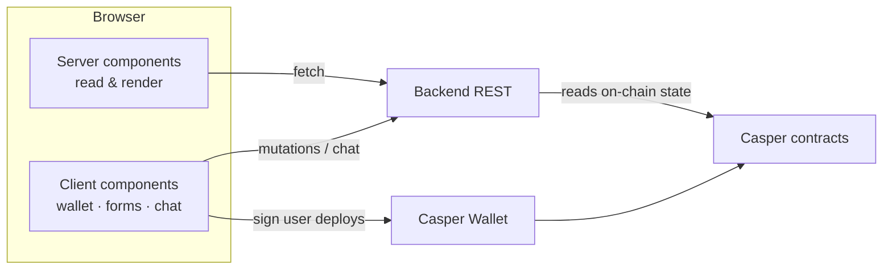
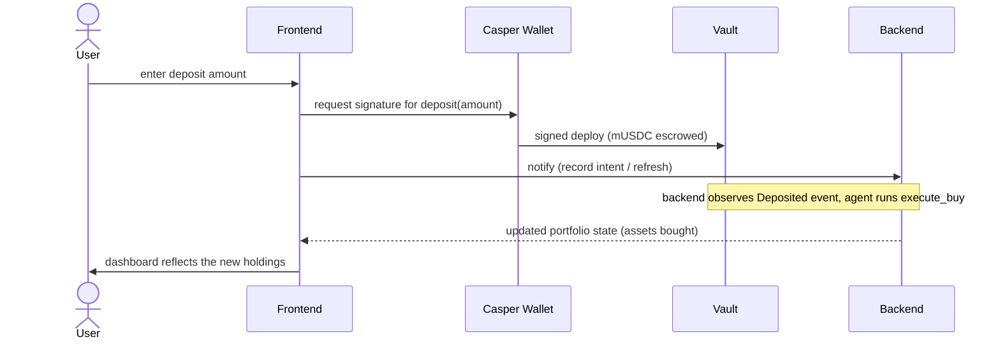

# Frontend — Architecture

Design of the Next.js frontend. For the API it calls, see `../backend/ARCHITECTURE.md`; for the contracts it signs against, `../contract/ARCHITECTURE.md`.

---

## 1. Principles

- **Display-only for money.** The UI renders values computed elsewhere (portfolio value, the contract's target allocation, required contribution). It performs no money math beyond formatting.
- **The signing boundary.** The frontend signs **user** actions only (`create_vault`, `deposit`, `withdraw`, `update_config`). It never initiates **agent** actions (`execute_buy`, `rebalance`, `set_price`) — those belong to the backend with the agent key.
- **Server components for reads, client components for interactivity.** Fetch portfolio/state data in server components where possible; isolate wallet, signing, and chat into client components.

---

## 2. Route map (App Router)

```
app/
  (onboarding)/        questionnaire + demographics -> profile result
  dashboard/           list of the user's portfolios (value, progress)
  portfolio/[vault]/   single portfolio:
                         - allocation: current vs target (read from chain via backend)
                         - goal: target amount/year, progress, suggested $X/month
                         - activity: rebalance history + agent rationale
                         - chat: agent Q&A
```

---

## 3. Data flow



- **Reads** (portfolio value, target allocation, projection, activity, chat history) come from the **backend**, which reads live on-chain state and merges its off-chain mirror. The frontend does not query the chain directly for these.
- **Writes** split:
  - *User-signed* (create/deposit/withdraw/edit) → built and signed client-side via `lib/casper.ts` → submitted to Casper → backend reflects the new state.
  - *Metadata* (submit answers, register a vault, ask the agent) → backend REST.

---

## 4. The wallet / signing layer (`lib/casper.ts`)

- Connects Casper Wallet (via CSPR.click / `casper-js-sdk`).
- Builds the deploys for the four **user** actions and requests a signature from the wallet.
- Surfaces deploy status; account for ~8s block time before the UI shows confirmed state (optimistic UI + reconcile against backend reads).
- Exposes **no** path to agent functions.

---

## 5. API client (`lib/api.ts`)

Typed wrapper over the backend REST surface (see `../backend/README.md`): onboarding, portfolios, starter/suggest, projection, chat, and the demo endpoints (oracle override, rebalance-now, faucet) used in the dashboard's demo controls.

---

## 6. Rendering portfolio state

For a single portfolio the UI shows, side by side:
- **Current allocation** — from holdings × oracle prices (computed by backend).
- **Target allocation** — the contract's **glide-path-adjusted** target, read via `view_state` (backend relays it). The UI does not compute glide.
- **Progress to goal** — current value vs `target_amount_usd`.
- **Suggested contribution** — the live-recomputed `$X/month` from the backend projection.
- **Activity** — rebalance log entries, each with the **agent rationale** shown inline.

All numeric values arrive as fixed-point; `lib/format.ts` converts to human strings. Never do value arithmetic in `number`; only format for display.

---

## 7. A user action, end to end (deposit)



The buy itself is triggered by the **backend** (agent key) after the deposit event — the frontend's job ends at the signed deposit and reflecting the result.

---

## 8. Demo controls

The dashboard includes a small demo panel (visible on testnet) wired to backend demo endpoints: set a mock price (push out of band), rebalance now, and mint test `mUSDC`. These let the rebalance + rationale be shown live. Keep them clearly separated from normal user actions.